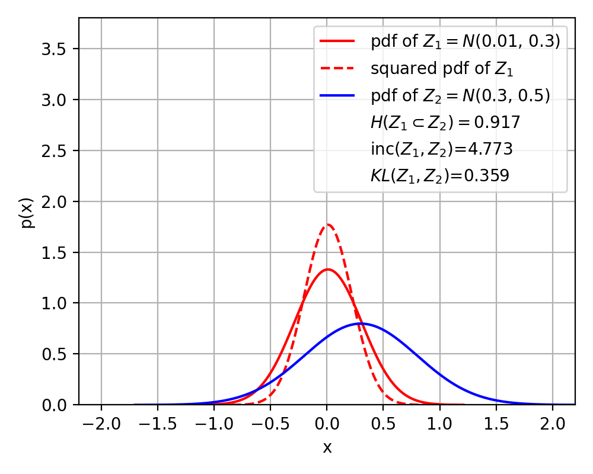
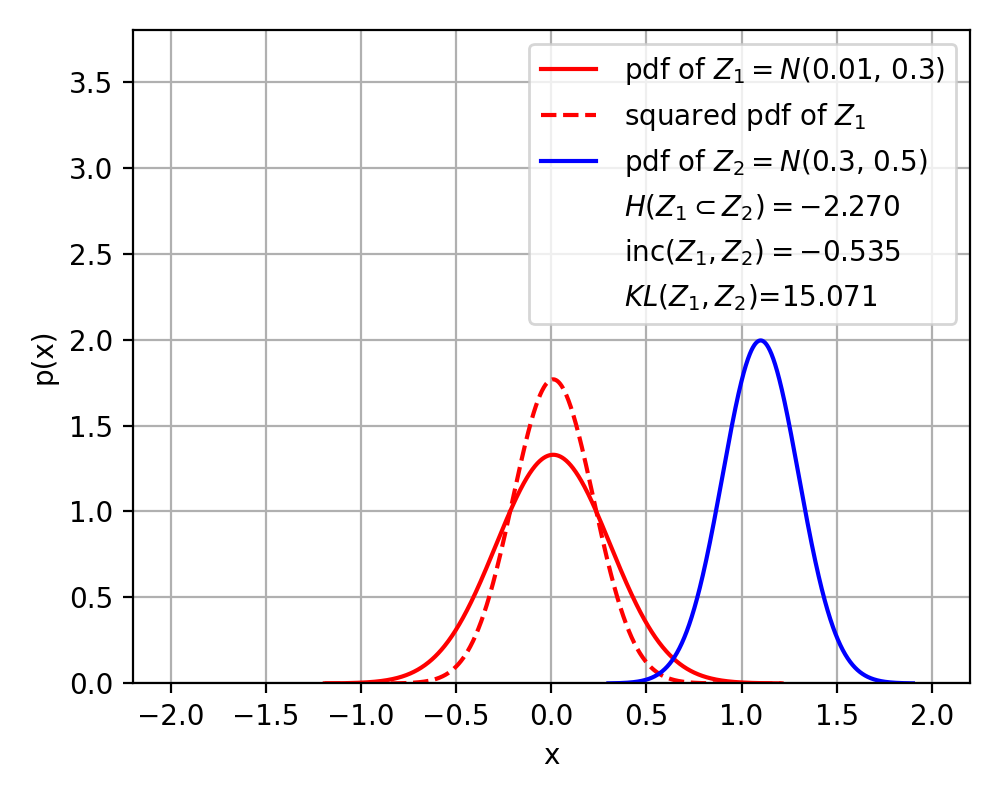
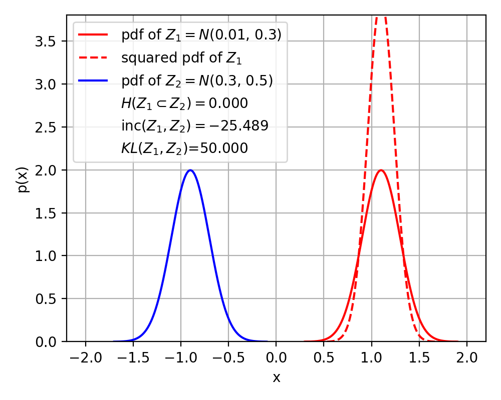

# expr1
```
python experiments/expr1/exec.py & python experiments/expr1/video.py
```
* Contrastive loss vs Soft contrastive loss (GIF below)

<p align="center">
  
</p>

<p align="center">
  
</p>

# expr2
```
python experiments/expr2/exec.py
```
* Correct Inclusion loss, KL-Divergence


<table align="center">
  <tr>
    <td align="center">
      <br>
      <em>(a)</em>
    </td>
    <td align="center">
      <br>
      <em>(b)</em>
    </td>
    <td align="center">
      <br>
      <em>(c)</em>
    </td>
  </tr>
</table>